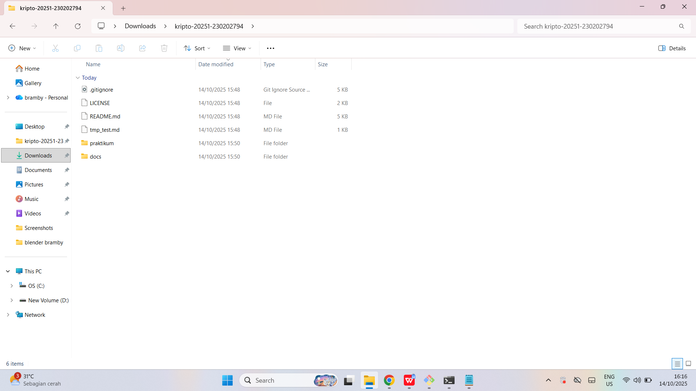

# Laporan Praktikum Kriptografi
Minggu ke-: 1
Topik: [week1-intro-cia]  
Nama: [Bramby Dida Baskara]  
NIM: [230202794]  
Kelas: [5IKRA]  

---

## 1. Tujuan
(Tujuan dari praktikum ini adalah untuk memahami konsep dasar kriptografi, mengenal istilah dan komponen utama dalam sistem kriptografi (plaintext, ciphertext, kunci, algoritma), serta menerapkan metode enkripsi sederhana seperti Caesar Cipher sebagai pengenalan terhadap sistem keamanan informasi.)

---

## 2. Dasar Teori
(Kriptografi sebuah ilmu dan seni untuk menjaga keamanan pesan dengan cara mengubah bentuk pesan asli (plaintext) menjadi bentuk yang tidak dapat dibaca (ciphertext) agar hanya pihak yang berhak yang dapat memahaminya. Kata kriptografi berasal dari bahasa Yunani “kryptos” (tersembunyi) dan “graphein” (menulis).

Dalam sejarahnya, kriptografi klasik menggunakan metode sederhana seperti Caesar Cipher dan Skitala Spartan. Pada Caesar Cipher, huruf-huruf pada pesan digeser sejauh jumlah tertentu. Sedangkan kriptografi modern telah berkembang menjadi sistem kompleks seperti RSA, AES, dan ECC yang digunakan dalam keamanan data, komunikasi, dan transaksi digital.

Prinsip dasar kriptografi meliputi kerahasiaan (confidentiality), integritas (integrity), dan autentikasi (authentication). Ketiganya menjadi pondasi utama dalam menjaga keamanan informasi di era digital.)

---

## 3. Alat dan Bahan
(Git dan akun GitHub)
---

## 4. Langkah Percobaan
(1.Membuat folder praktikum/week1-cryptography/.

2.Membuat file caesar_cipher.py di dalam folder tersebut.

3.Menulis program untuk melakukan enkripsi dan dekripsi menggunakan metode Caesar Cipher.

4.Menjalankan program dengan perintah: 
python caesar_cipher.py

5.Menguji hasil dengan berbagai kombinasi plaintext dan kunci.

6.Mengunggah hasil dan kode program ke repositori GitHub.
---


## 5. Source Code
(https://github.com/Brammmx/kripto-20251-230202794/edit/main/praktikum/week1-intro-cia/laporan.md)

# Contoh penggunaan
plain = "HELLO"
key = 3
cipher = encrypt(plain, key)
print("Plaintext :", plain)
print("Ciphertext:", cipher)
print("Dekripsi  :", decrypt(cipher, key))


---


## 6. Hasil dan Pembahasan
(Hasil eksekusi program Caesar Cipher menunjukkan bahwa pesan "HELLO" dengan pergeseran 3 menghasilkan ciphertext "KHOOR".
Program juga berhasil mengembalikan ciphertext ke bentuk semula menggunakan fungsi dekripsi.
| Input | Kunci | Output Enkripsi | Output Dekripsi |
| :---- | :---- | :-------------- | :-------------- |
| HELLO | 3     | KHOOR           | HELLO           |
| WORLD | 5     | BTWQI           | WORLD           |

Hasil eksekusi program Caesar Cipher: Hasil sesuai dengan teori Caesar Cipher. Tidak ditemukan error selama eksekusi.


)

---

## 7. Jawaban Pertanyaan
(1. Apa tujuan utama dari kriptografi?
Menjaga kerahasiaan, integritas, dan autentikasi data agar hanya pihak berwenang yang dapat mengakses informasi.

2. Sebutkan contoh algoritma kriptografi modern!
AES, RSA, ECC, Diffie-Hellman, dan SHA-256.

3. Apa perbedaan antara plaintext dan ciphertext?
Plaintext adalah pesan asli yang dapat dibaca, sedangkan ciphertext adalah pesan hasil enkripsi yang tidak dapat dibaca tanpa kunci.)
---

## 8. Kesimpulan
(Melalui praktikum ini, mahasiswa memahami dasar-dasar kriptografi serta cara kerja metode enkripsi sederhana seperti Caesar Cipher. Praktikum ini menjadi dasar untuk memahami sistem keamanan modern yang lebih kompleks seperti RSA dan AES.)

---

## 9. Daftar Pustaka
(Setyaningsih, E. (2015). Kriptografi dan Aplikasinya Menggunakan MATLAB. ANDI OFFSET, Yogyakarta.

William Stallings. (2017). Cryptography and Network Security: Principles and Practice. Pearson.

Bruce Schneier. (1996). Applied Cryptography. John Wiley & Sons.

Jonathan Katz & Yehuda Lindell. (2014). Introduction to Modern Cryptography. CRC Press.)

---

## 10. Commit Log
(Tuliskan bukti commit Git yang relevan.  
Contoh:
```
commit a1b2c3d4
Author: bramby <brammmx@github.com>
Date:   2025-10-3

    Add: Caesar Cipher encryption & decryption program


    week2-cryptosystem: implementasi Caesar Cipher dan laporan )
```
